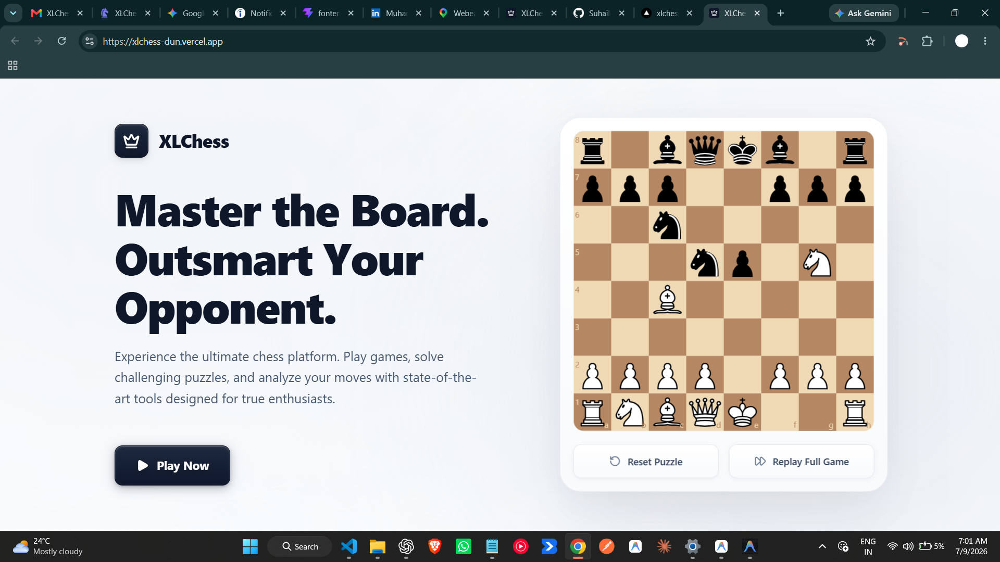

# ♟️ XLChess

XLChess is a modern chess landing page built with React and TypeScript. The goal of this project was to create a clean and responsive interface with smooth animations and an interactive chessboard that demonstrates a replayable chess sequence.

## Live Demo

🔗 https://xlchess-dun.vercel.app/

---

## Preview



---

## Features

- Responsive layout for desktop, tablet, and mobile
- Smooth hero entrance animation
- Interactive chessboard using react-chessboard
- Automatic chess move replay
- Replay Full Game button
- Reset Puzzle button
- Clean component-based architecture
- Built with TypeScript
- Accessible animations with reduced motion support

---

## Tech Stack

- React
- TypeScript
- Vite
- Tailwind CSS
- Framer Motion
- react-chessboard
- chess.js
- Lucide React

---

## Project Structure

```text
src
│
├── components
│   └── Hero
│       ├── Chess
│       │   ├── ChessBoard.tsx
│       │   ├── ChessControls.tsx
│       │   ├── moves.ts
│       │   ├── types.ts
│       │   ├── useChessAnimation.ts
│       │   └── usePuzzle.ts
│       │
│       ├── FloatingPieces.tsx
│       ├── Hero.tsx
│       ├── HeroContent.tsx
│       └── animations.ts
│
├── App.tsx
├── main.tsx
└── index.css
```

---

## Getting Started

Clone the repository

```bash
git clone https://github.com/Suhail-code8/xlchess.git
```

Go into the project

```bash
cd xlchess
```

Install dependencies

```bash
npm install
```

Start the development server

```bash
npm run dev
```

Create a production build

```bash
npm run build
```

Preview the production build

```bash
npm run preview
```

---

## Design Notes

The layout follows a simple two-column hero section with the content on the left and the interactive chessboard on the right.

Some small details included in the project:

- Sequential chess move animation
- Smooth page entrance animation
- Responsive spacing
- Subtle background lighting
- Interactive buttons
- Clean visual hierarchy

The focus was to keep the UI modern without making it feel overly animated.

---

## Challenges

Some parts of the project required a bit more work than expected:

- Managing chess replay without conflicting states
- Separating animation logic from presentation
- Making the hero responsive while keeping the chessboard aligned
- Creating smooth animations without affecting performance

---

## Future Improvements

- Multiple chess puzzles
- Difficulty levels
- Drag and drop gameplay
- Sound effects
- Dark mode
- Move history
- Chess engine integration
- Online multiplayer

---

## License

This project is available under the MIT License.

---

## Author

**Muhammad Suhail**

- GitHub: https://github.com/Suhail-code8
- LinkedIn: https://www.linkedin.com/in/suhail-m8/